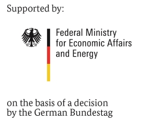

# MEO.EnergyAgents
**M**odel **E**xperiments in the **O**perative Energy System Analysis by using Energy Agents

In the context of [MODEX](https://www.energieforschung.de/forschung-und-innovation/systemanalyse/modex), MEO is one of six projects that are founded by the [German *Federal Ministry of Economic Affairs and Energy*](https://www.bmwi.de/Navigation/EN/Home/home.html) to improve the capabilities and the comparability of energy system models. Especially in MEO, [eight operational models](https://www.enargus.de/pub/bscw.cgi/?op=enargus.eps2&s=1&q=03ET4078&v=10) will be compared by calculating and examine different scenarios in electrical distribution grids. In this way, it should be determined which model is particularly suitable for which questions. In addition, the comparison aims to identify where the optimization potential of the participating models lies.

---
In this repository, the [SOFTEC-Team](https://www.softec.wiwi.uni-due.de/en/) of the [University Duisburg-Essen](https://www.uni-due.de/en/index.php), hosts its developments and the cumulative documentation of the project. This also aims to provide an introductory tutorial for the use of [Agent.Workbench](https://github.com/EnFlexIT/AgentWorkbench), the Energy Option Model (EOM) and the thereon based [Energy Agent](https://github.com/EnFlexIT/EnergyAgents).  

